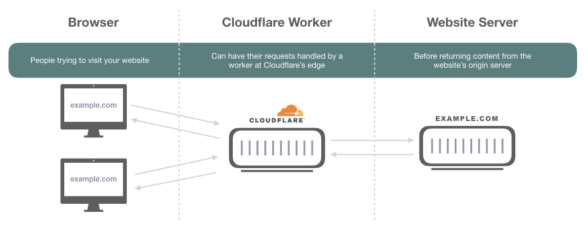
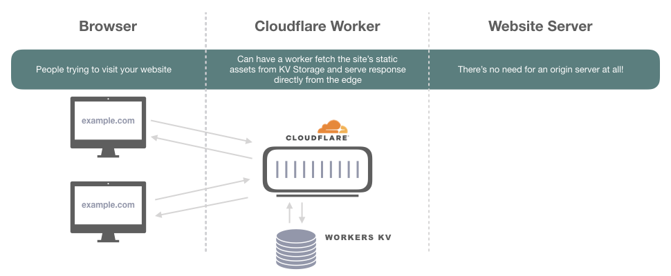

I currently work at [Cloudflare](https://www.cloudflare.com/)
as an engineer building tools for their Trust and Safety team. 
It's an exciting place to work because Cloudflare is a company with loads of different products from core services like our CDN (content delivery network), firewall and ddos mitigation to newer products like Cloudflare Workers and Workers KV Storage. 

I figured it would be a shame to not leverage Cloudflare Workers more in my personal projects and decided to see how easy it was to build a static site and deploy it entirely on Cloudflare Workers. It's worth noting that deployment of static sites is not the only use case for workers, check out the Workers 
[developer docs](https://developers.cloudflare.com/workers/) for other cool use-cases like
localization, bulk redirects, and even applications like slack bots!

---

## How I built this blog
This blog is a Gatsby react app deployed directly to Cloudflare's edge - and it only took three steps and a few hours one Saturday morning!

1. [Build a react app with Gatsby framework](#step1)
2. [Get a domain name and configure Cloudflare DNS (optional)](#step2)
2. [Configure Wrangler CLI to deploy worker](#step3)

### Assumptions
This tutorial assumes that you already have the following:
- A [Cloudflare account](https://dash.cloudflare.com/login)  - this is free!
- A [Workers Unlimited subscription](https://workers.cloudflare.com/) - this is only $5/mo!
- Access to and familiarity with your computer's command line
- Ability to install Gatsby CLI and Wrangler CLI (1.4.0 or above)

---

## What is Cloudflare Workers and KV?
Cloudflare Workers are basically just javascript functions which run at the edge. When I say **"edge"**, 
I just mean the collection of over 200 Cloudflare data centers across the world which comprise our global network. This is how a worker is typically used to augment or alter responses from a site's origin server:



Workers KV storage is a light key-value cloud storage solution which is accessible to workers running at the "edge". The incredible thing is that Workers KV can even be used to store a site's static assets.



This means that if you have a static site that you want to run super fast, you actually don't *need* to stand up your own origin server somewhere to host your content - you can just deploy it using Cloudflare Workers + KV and make your worker respond to requests from the edge directly. Check out the steps I took to do this below!

---

### 1) Build a react app with gatsby framework <a name=step1></a>

This section is pretty straightforward. You'll have to know a little bit about node and be comfortable in your terminal but it should be easy to get started!

- First, make sure you have the Gatsby CLI installed - I recommend looking through their [Quick Start documentation](https://www.gatsbyjs.org/docs/quick-start)

- Next, pick your starter/theme! I found mine [here](https://www.gatsbyjs.org/starters/?v=2) and then could just install locally by running:
```
gatsby new tiffany-moeller https://github.com/codebushi/gatsby-starter-forty
``` 
*Note: Replace "tiffany-moeller" above with whatever you want your project name to be*

- Finally, you only have to be able to run `gatsby develop` from the root of your new project to be ready to deploy.
If everything goes well, you should be able to open a browser and go to [localhost:8000](http://localhost:8000) to see your new site!
Don't feel like you need to make it perfect now - you can always come back and update your site after the "hello world" version is deployed!

### 2) Get a domain name and configure Cloudflare DNS (optional) <a name=step2></a>

<div class="dark box">
This step is optional because you can technically deploy your static site as a <b>workers.dev</b> subdomain if you don't care about having your own domain name.
The rest of this tutorial will assume that you have purchased a domain name and can switch over the nameservers to your Cloudflare account. 
At the end, I'll share what I could have done differently to just deploy to the workers.dev subdomain like <a href="https://tiffany-moeller.tifmoe.workers.dev/">this</a>.
</div>

I noticed that `tiffanymoeller.com` was available on [porkbun.com](https://porkbun.com/) and I wanted to make a website with my name :)
The first step was to purchase my domain name from [porkbun.com](https://porkbun.com/) and log into my free [Cloudflare account](https://dash.cloudflare.com/login).

In my Cloudflare dashboard, I just add to click to add a new site and then I could copy the two Cloudflare nameservers assigned to my site
and replace my domain's existing nameservers in porkbun with these two new Cloudflare nameservers! For more info on this part 
see the [Cloudflare Support Docs](https://support.cloudflare.com/hc/en-us/articles/205195708)

### 3) Configure Wrangler CLI to deploy worker <a name=step3></a>

Now that you have your app, domain name and Cloudflare account ready, you can deploy with Wrangler. [Wrangler](https://developers.cloudflare.com/workers/tooling/wrangler/) is a Cloudflare CLI built  to help improve the developer experience with workers. 
We'll use it to automate tasks like creating a new KV namespace, uploading our static assets and deploying our new site.

First, initialize Wrangler in the root of your project directory. 
This will automatically generate two things:

- A `wrangler.toml` configuration file
- A workers-site folder in your project

Your `wrangler.toml` file might look pretty sparse initially, but we'll add configuration to tell Wrangler which build file contains our site's static assets (`./public` for my Gatsby project) and which Cloudflare account, zone and even route to deploy the deploy the worker to. 
For example, my configuration looked like:

```javascript
name = "tiffany-moeller"
type = "webpack"
account_id = "< ACCOUNT ID >"
zone_id = "< ZONE ID >"
workers_dev = false
route = "tiffanymoeller.com/*"

[site]
bucket = "./public"
entry-point = "workers-site"
```

<div class="dark box">
Pro Tip: You don't <i>need</i> to deploy to a specific zone and route if you don't have your own domain name.
You can always deploy your site as a subdomain of <b>workers.dev</b> by:
    <ul>
        <li> Make <b>workers_dev = true</b> above </li>
        <li> Remove the <b>zone_id</b> and <b>route</b> fields </li>
    </ul>
</div>

You'll want to follow the [Configure Quick Setup](https://developers.cloudflare.com/workers/quickstart/#configure) steps for Wrangler to configure everything before deploying. 
In my case, I just needed to do the following:
- Create an API Token with the "Edit Cloudflare Worker Template"
- Register the API token with Wrangler by running `wrangler config`

The final step is to build your site with yarn and publish with Wrangler. I added a shortcut for this in my
project's `package.json` file, in the scripts section:

```diff
    "scripts": {
        "build": "gatsby build",
        "develop": "gatsby develop",
    +   "deploy": "yarn run build && wrangler publish",
```

After this was in place, I just had to run my new command `yarn deploy` to publish this new site!


