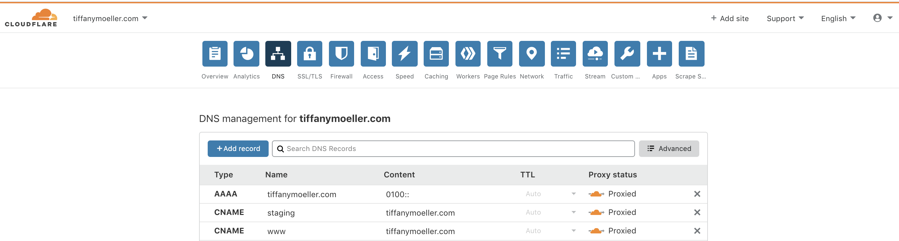
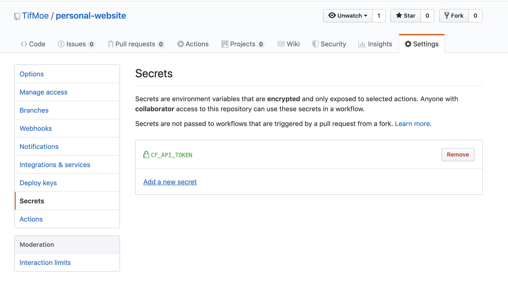
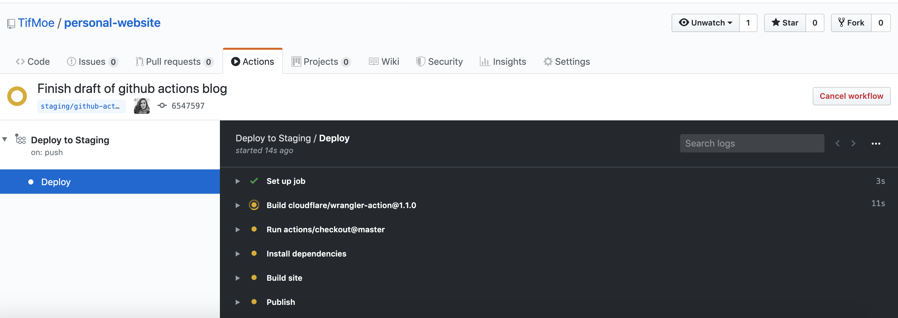

This is basically a part two of my post on [how I built this serverless blog]((/blog/static-sites-using-workers)) running entirely on Cloudflare Workers. The source code for this blog lives [in github](https://github.com/TifMoe/personal-website) and I wanted to configure a some automated deployment pipelines so that when I push any new code on a branch beginning with `staging/` it will automatically build and deploy the code to a staging environment and when I merge a PR into `master/` it will automatically build and deploy the new version of tiffanymoeller.com you're reading now!

Leveraging [github actions](https://help.github.com/en/actions), I was able to build out two new continuous deployment pipelines for this serverless blog in three steps:

1. [Make a staging subdomain for my website](#step1)
2. [Add new environments to my workers configuration](#step2)
3. [Publish two new github actions](#step3)

<div class="dark box">
<b>Note:</b> This tutorial assumes that you already have a worker's site deployed to your own domain on Cloudflare and are not just using the workers.dev domain.
It also assumes you have your source code in github (even if it's a free account!)
</div>

## 1. Make a staging subdomain <a name=step1></a>
To create a new staging subdomain, all you need to do is add a new CNAME record in your Cloudflare DNS settings to point `staging` to your root domain! This is what it looked like when I configured mine:



Please note that it can sometimes take a few hours for new DNS records to propagate so don't worry if you can't immediately see your site at the staging subdomain you just added! 

<div class="dark box">
<b>Pro Tip!</b> If you're not interested in having the rest of the world able to see unfinished versions of your site on this staging subdomain, consider using Cloudflare Access to protect it from public view. It's free for you to authenticate up to 5 different email addresses!!
</div>

## 2. Add new environments to workers configuration <a name=step2></a>
Now I can define a staging and production environment in my workers configuration via my wrangler.toml file. There is great documentation on defining different environments for workers deployments in the [official documentation](https://developers.cloudflare.com/workers/tooling/wrangler/configuration/environments/)

After adding my new environments, my wrangler.toml file looked like:
```javascript
type = "webpack"
account_id = "< ACCOUNT ID >"
zone_id = "< ZONE ID >"

[env.staging]
name = "tiffany-moeller-staging"
workers_dev = false
route = "staging.tiffanymoeller.com/*"

[env.production]
name = "tiffany-moeller"
workers_dev = false
route = "tiffanymoeller.com/*"

[site]
bucket = "./public"
entry-point = "workers-site"
```
This will let me deploy things to staging.tiffanymoeller.com before they are deployed to tiffanymoeller.com! Now we just need to define the automatic deployment pipelines using github actions! 

## 3. Publish new github actions! <a name=step3></a>
There's great documentation on github actions [here](https://help.github.com/en/actions/configuring-and-managing-workflows/configuring-a-workflow). Instead of building my own pipeline from scratch, I decided to use the supported github action in the marketplace which was developed by Cloudflare's workers team! You can find out more about the <b>Deploy to Cloudflare Workers with Wrangler</b> github action [here](https://github.com/marketplace/actions/deploy-to-cloudflare-workers-with-wrangler). 

I made two new files, `staging.yml` and `main.yml` and added them to a `.github/workflows` folder in my project so github actions would know where to find them. 

They are basically the same, but one will deploy to the staging environment when code is pushed to any branch beginning with `staging/` and the other will deploy to the production environment when code is pushed to my `master` branch.

### staging.yml
```yaml
name: Deploy to Staging

on:
  push:
    branches:
      - 'staging/*'

jobs:
  deploy:
    runs-on: ubuntu-latest
    name: Deploy
    steps:
      - uses: actions/checkout@master

      - name: Install dependencies
        run: yarn install --prod --pure-lockfile

      - name: Build site
        run: 'yarn run build'

      - name: Publish
        uses: cloudflare/wrangler-action@1.1.0
        with:
          apiToken: ${{ secrets.CF_API_TOKEN }}
          wranglerVersion: '1.6.0'
          environment: 'staging'
```


### main.yml
```yaml
name: Deploy to Production

on:
  push:
    branches:
      - master

jobs:
  deploy:
    runs-on: ubuntu-latest
    name: Deploy
    steps:
      - uses: actions/checkout@master

      - name: Install dependencies
        run: yarn install --prod --pure-lockfile

      - name: Build site
        run: 'yarn run build'

      - name: Publish
        uses: cloudflare/wrangler-action@1.1.0
        with:
          apiToken: ${{ secrets.CF_API_TOKEN }}
          wranglerVersion: '1.6.0'
          environment: 'production'
```

### Defining the API Token in your github secrets! 
Before github actions can execute the pipelines above, you'll need to define the `apiToken` value as an encrypted [Github secret](https://help.github.com/en/actions/configuring-and-managing-workflows/creating-and-storing-encrypted-secrets) in your repository. 

Use the same Cloudflare Worker Token you have used when configuring your wrangler deployments manually with `wrangler config`. If you don't yet have a Cloudflare API token you can create one by visiting https://dash.cloudflare.com/profile/api-tokens and creating a new token using the <b>"Edit Cloudflare Workers"</b> template. 

Then you can add the `CF_API_TOKEN` secret to your github project like I did here:



Now when I push code to any branch beginning with `staging/`, github automatically builds the new code and deploys to my secret staging enviornment. When the branch is ready to be merged into master it will auto-deploy to the blog you're reading now! 

If you need to check the status of your automatic builds or debug any of the pipeline configuration, take a look at the Actions tab in your github repo! 


