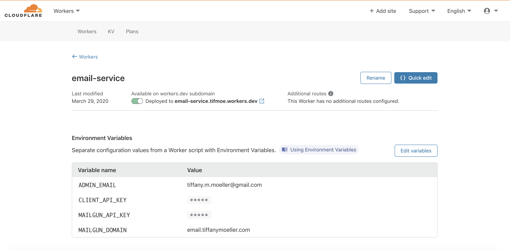
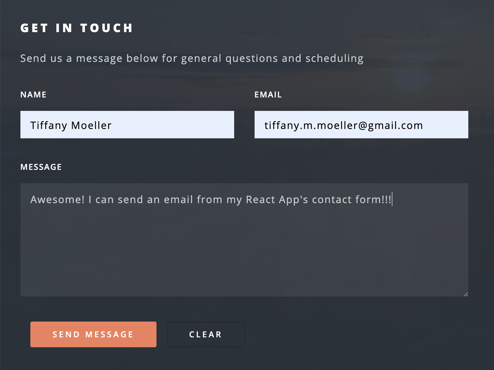

I was building a serverless React application for a friend's business and wanted to enable a contact form without needing to build a backend service to handle the email submission. Here's the end result in action!


After researching a bit, I found an excellent example of a serverless email function from [Max Kostinevich](https://maxkostinevich.com/blog/serverless-contact-form/) and used this as inspiration for my own. To make my contact form work I took the following steps:

1. [Sign up for an API accessible email service](#step1)
2. [Write a workers script to handle sending emails](#step2)
3. [Update the contact form to send requests to email service](#step3)

---

## 1. Sign up for an API accessible email service <a name=step1></a>
You can use any email service with an API for this step but I decided to use [mailgun](https://www.mailgun.com/) for my first contact form. I registered an email subdomain to the mailgun account and made sure that I could use the API to trigger an email like:

```bash
curl --location --request POST 'https://api.mailgun.net/v3/<MAILGUN_DOMAIN>/messages' \
    --user 'api:MAILGUN_API_KEY'
    --form 'from=test@<MAILGUN_DOMAIN>' \
    --form 'to=tiffany.m.moeller@gmail.com' \
    --form 'subject=TEST' \
    --form 'text=Awesome! I can send an email with a simple API call'
```

## 2. Write a workers script to handle sending emails <a name=step2></a>
But I don't want to hit the mailgun endpoint directly from inside my React application, I want to create a separate serverless function which can act like a backend to handle sending my emails when a new contact form entry is submitted. 

Luckily, we can do that with another Cloudflare worker! I'm also going to leverage the new functionality to [add environment variables to Workers scripts](https://blog.cloudflare.com/workers-secrets-environment/) which was released last month.

Since there are no dependencies in this script, it can be deployed directly from the Cloudflare UI where I'll start by adding the following environment variables:

|Environment Variable| Description|
|---|---|---|
|`ADMIN_EMAIL`|Email to recieve contact form entries|
|`CLIENT_API_KEY`|Key in my React app to authenticate request (optional)|
|`MAILGUN_API_KEY`| API key in mailgun account|
|`MAILGUN_DOMAIN`| Verified email subdomain I added to my mailgun account|




The workers script itself is pretty straightforward and can be found in my github [here](https://github.com/TifMoe/serverless-email-service/blob/master/email-service.js). This can be deployed to a workers.dev domain directly in your Cloudflare dashboard.

At this point I could confirm that my workers script is functioning as expected by sending a json request to send the same email as above in step 1:

```bash
curl POST 'https://email-service.tifmoe.workers.dev' \
    --header 'Client-Key: < API KEY >' \
    --header 'Content-Type: application/json' \
    --data-raw '{
        "name": "TEST",
        "message": "Awesome! I can send an email with a simple API call",
        "email": "tiffany.m.moeller@gmail.com",
        "email2": "",
        "org": "Test Organization"
    }'
```

You'll notice that there is a field above for "email2" - this is a honeypot field which is not rendered in the front-end so it should never be populated by a human but might be filled out by a bot. If the honeypot field is ever not "", then the workers email service will not process the request. 

## 3. Update the contact form to send requests to email service <a name=step3></a>
I already had a pretty basic contact form added to my React application so I just needed to add a new function to send a request to the serverless function above. 

This is the function handling form submissions:
```javascript
function UseFetchPost(url, data) {
    async function fetchUrl() {
        const response = await fetch(url, {
            method: "POST",
            headers: {
                "Content-Type": "application/json",
                "Client-Key": < API_KEY_ENVIRONMENT_VARIABLE >
            },
            body: JSON.stringify(data),
        });
        const json = await response.json().then(value => ({
                status: response.status,
                message: value['message']
            })
        );
        return json;
    }

    return fetchUrl();
}

export default UseFetchPost;
```

The `UseFetchPost` function above will be called on form submission event from inside my `Contact` class:

```javascript
import React from 'react';
import UseFetchPost from './SubmitForm';

export default class Contact extends React.Component {
    defaultState = {
        name: "",
        email: "",
        email2: "",
        message: "",
        org: "< ADMIN NAME >"
      }

    constructor(props) {
        super(props);
        this.state = this.defaultState;
    }

    handleInputChange = event => {
        const target = event.target
        const value = target.value
        const name = target.name
        this.setState({
            [name]: value,
        })
    }

    handleReset = event => {
        this.setState(this.defaultState)
    }

    handleSubmit = event => {
        event.preventDefault()
        let response = UseFetchPost(
                "https://email-service.tifmoe.workers.dev",
                this.state      // input values saved to state on change
            )
        // handle response
      }

    render() {
        return (
        <div>
        <section id="contact">
            <div className="inner">
            <section>
                <form
                    onSubmit={this.handleSubmit}
                    onReset={this.handleReset}
                >
                    <h3>Get in touch</h3>
                    <p>Send us a message below </p>
                    <div className="field half first">
                        <label htmlFor="name">Name</label>
                        <input
                            type="text"
                            name="name"
                            id="name"
                            value={this.state.name}
                            onChange={this.handleInputChange}
                            required
                        />
                    </div>
                    <div className="field half">
                        <label htmlFor="email">Email</label>
                        <input
                            type="email"
                            name="email"
                            id="eml1"
                            value={this.state.email}
                            onChange={this.handleInputChange}
                            required
                        />
                    </div>
                    <div className="field">
                        <label htmlFor="message">Message</label>
                        <textarea
                            name="message"
                            id="message"
                            rows="6"
                            value={this.state.message}
                            onChange={this.handleInputChange}
                            required
                            maxLength="500"
                        ></textarea>
                    </div>
                    <ul className="actions">
                        <li><input
                            type="submit"
                            value="Send Message"
                            className="button primary fit"
                        /></li>
                        <li><input
                            type="reset"
                            value="Clear"
                            className="button"
                        /></li>
                    </ul>
                    <input
                        type="text"
                        class="invisible"
                        name="email2"
                        value=""
                        value={this.state.email2}
                        onChange={this.handleInputChange}
                    />
                </form>
            </section>
            </div>
        </section>
        </div>
        )
    }
}
```

And now I can confirm that emails are able to be sent from the web application!! 


