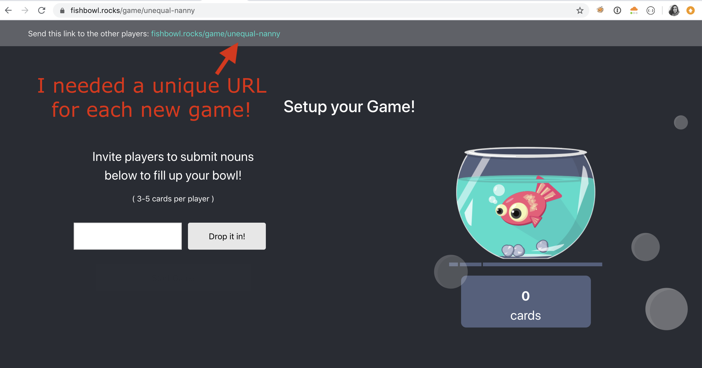
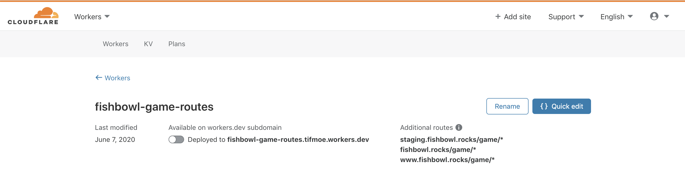
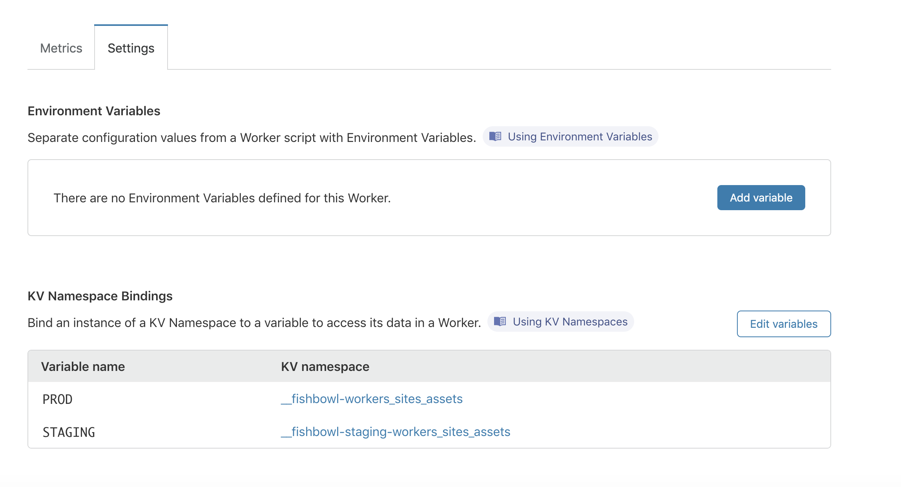

During quarintine I built a little game to let people play the classic party game, Fishbowl (aka Monikers), from a safe distance. You can check it out at [fishbowl.rocks](https://fishbowl.rocks/)


## Enter... React Router!
A condition of this game is that I needed to create unique URLs for each instance of the game so people can share the link with other players. 



Rendering URLs with path parameters like `game/:pathParam` is really easy to manage using React Router. You can see below that I'm rendering my `GamePage` component any time a request matches the path `/game/< ANY STRING >`. 

```javascript
import React from 'react';
import { BrowserRouter, Route, Switch } from 'react-router-dom';

import HomePage from './pages/Home';
import GamePage from './pages/Game';

import './App.css';

function App() {
  return (
    <BrowserRouter>
    <div className="App">
        <Switch>
         <Route path="/" component={HomePage} exact/>
         <Route path="/game/:gameId" component={GamePage}/>
       </Switch>
    </div>
  </BrowserRouter>
  );
}

export default App;
```

So when a request comes to the index page of my app and the path matches `/game/:gameId` (where `:gameId` is any string) then it will render the `GamePage` component. I am able to use the value of `:gameId` inside this component to ensure that actions taken in the game are tied to that unique identifier of a specific game instance. 

The above root App is rendered in my index html with the following so that any request to the root index of my game (`fishbowl.rocks/`) will be handled by the routing logic above:
```javascript
ReactDOM.render(
  <React.StrictMode>
    <App />
  </React.StrictMode>,
  document.getElementById('root')
);
```

---

## Static site problem
This works fine when a user starts on the index page - because requests to the index (`fishbowl.rocks/`) goes to my index.html page which renders the `App` component you see above. The React Router inside of the `App` will send the user to a `/game/:gameID` page and render the correct component. 

However, when a user doesn't come to the app through the root... in other words when they go directly to `fishbowl.rocks/game/unequal-nanny` to join an existing game - my React app doesn't know what to do because there is no statically generated page called `unequal-nanny/index.html` for it to render. 

---

## Option 1 - Handle dynamic routes on server side 
When I began this project I was serving my static frontend from the same server which held my websocket routes for all the backend functionality. I was able to resolve the static site problem above but making any request matching the pattern `/game/` return index.html... letting the React Router handle rendering the correct game component based on the path. 

The relevant code for my router in the main file of my go program looked like this:
```go
package main

import (
	"log"
	"net/http"
	"path/filepath"

	"github.com/gorilla/mux"

	"github.com/tifmoe/go-fishbowl/src/api"
)

const (
    staticPath = "./web" // This is where my frontend build would live in the docker container
    indexPath  = "index.html"
)

func main() {

    // ... Other code, irrelevant to router example ... //

    // Instantiate new mux router using github.com/gorilla/mux
    r := mux.NewRouter()
    
    // Instantiate backend websocket router with pool and handlers already defined (not shown in example here)
    wsRouter := api.NewRouter(pool, handlers)
	r.PathPrefix("/ws/").Handler(wsRouter)

	// Serve Frontend routes
	// For requests to dynamically generated game pages, serve index.html
	r.PathPrefix("/game/").HandlerFunc(func(w http.ResponseWriter, r *http.Request) {
		http.ServeFile(w, r, filepath.Join(staticPath, indexPath))
    })

	// Serve static build on root requests
	r.PathPrefix("/").Handler(http.FileServer(http.Dir(staticPath)))

	// Run
	if err := http.ListenAndServe(":8080", r); err != nil {
		log.Fatalf("Failed to run server: %v", err)
    }
}
```
If you follow the example above you'll see that any request which came to my server running at `fishbowl.rocks` would be evaluated by the request path in this order:
- Does it match `fishbowl.rocks/ws/*`? Handle with websocket routes
- Does it match `fishbowl.rocks/game/*`? Handle with React Router in index.html
- Does it match `fishbowl.rocks/*`? Serve React App build

This worked fine, but I eventually wanted to move my frontend somewhere else - specifically to Cloudflare workers as a serverless frontend site which would make websocket connections to my go backend. 

If you aren't familiar with hosting static sites on Cloudflare workers, check out [my blog post](https://tiffanymoeller.com/blog/static-sites-using-workers) on how I deployed this blog to Cloudflare Workers! 

---

## Option 2 - Handle dynamic routes in a worker
But I found the same issue haunted me when serving my static site from Cloudflare Workers. You see, the way your site is rendered from Cloudflare Workers is that all your static assets have been pre-built and are stored in workers kv. So when a request comes into your worker, it will try to find the appropriate static asset in kv to serve for that request. 

But when a request comes in for a route that does not have an associated static file (such as `fishbowl.rocks/game/game-name`)  it would not be able to find the associated static file and would throw a 500 with an error like:
```
could not find game/game-name/index.html in your content namespace
```
How could I force my workers site to return the main `/index.html` when a request comes in for a non-root request?

### Solution - ANOTHER WORKER!

I just had to deploy a light-weight worker to intercept requests to my fishbowl site which match the `/game/*` path and return the root `index.html`. You can see that this worker is deployed on both my staging and production sites:



This is all is it folks - just a few lines of javascript which can be added directly from your Cloudflare dashboard:
```javascript
addEventListener('fetch', event => {
  return event.respondWith(handleRequest(event.request))
})

/**
 * Respond to the request
 * @param {Request} request
 */
async function handleRequest(request) {
    const init = {
      headers: {
        'content-type': 'text/html;charset=UTF-8',
      },
    }

    const assets = [
      { host: 'staging.fishbowl.rocks', kv: STAGING },
      { host: 'fishbowl.rocks', kv: PROD },
      { host: 'www.fishbowl.rocks', kv: PROD },
    ]
    
    let url = new URL(request.url)
    let e = assets.find((env) => env.host === url.host)

    const list = await e.kv.list({"prefix": "index."})
    const html = await e.kv.get(list.keys[0].name)
    return new Response(html, init)
}
```
You can see that I'm using the same little script to support this dynamic routing thing on both the staging and production versions of my site - it can be made even more simple if you only need to support a single static site per worker. 

The last step is to bind the static asset builds in Workers KV to the correct KV Variable Name for use in this script like:


